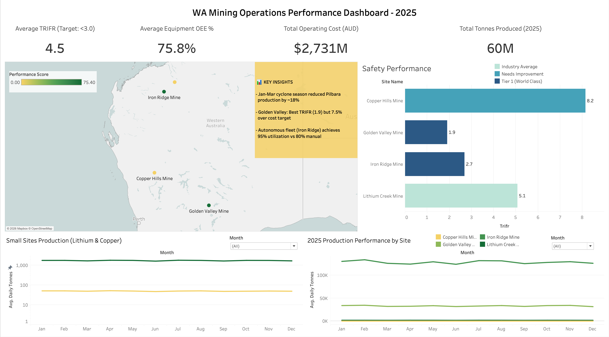

# Mining-Operations-Dashboard

# WA Mining Operations Performance Dashboard

## Project Overview

Interactive Tableau dashboard analyzing operational performance across 4 Western Australian mine sites in 2025. Provides executive-level insights into production efficiency, safety metrics, equipment performance, and cost optimization opportunities.

**[→ View Live Dashboard on Tableau Public](https://public.tableau.com/views/Mining_Operations_Dashboard/PerformanceDashboard?:language=en-US&:sid=&:redirect=auth&:display_count=n&:origin=viz_share_link)**

---

## Key Features

### Executive KPI Cards
- **Total Production:** 60M tonnes across all sites
- **Safety Performance:** Average TRIFR of 4.5 (target: <3.0)
- **Equipment Efficiency:** 75.8% average OEE
- **Operating Costs:** $2.7B total annual expenditure

### Interactive Visualizations
1. **Site Performance Map** - Geographic visualization of 4 mine sites color-coded by overall performance score
2. **Production Trends** - Monthly production analysis showing cyclone season impact (Jan-Mar)
3. **Safety Performance** - TRIFR benchmarking by site with color-coded risk categories
4. **Small Sites Analysis** - Dedicated view for lower-volume operations (Lithium & Copper)

### Key Insights
- Cyclone season reduced Pilbara production by ~18% (Jan-Mar)
- Golden Valley Mine: Best TRIFR (1.9) but 7.5% over cost target
- Autonomous fleet (Iron Ridge) achieves 95% utilization vs 80% manual

---

## Technologies Used

- **Python (Google Colab):** Synthetic data generation
- **SQLite:** Database creation and management
- **SQL:** Complex queries for analysis (5 key analytical queries)
- **DB Browser for SQLite:** Database visualization and query execution
- **Tableau Public:** Interactive dashboard creation
- **Perplexity AI:** Industry research and benchmark validation

---

## 📁 Data Structure

### Source Data (5 CSV files)
- `query1_site_performance_ranking.csv` - Overall site metrics and performance scores
- `query2_equipment_downtime_analysis.csv` - Equipment reliability and OEE data
- `query3_monthly_production_trends.csv` - Daily production by site and month
- `query4_safety_incident_analysis.csv` - Safety incidents and TRIFR/LTIFR
- `query5_cost_efficiency_analysis.csv` - Operating costs by category

### Database Schema
SQLite database with 6 tables and proper indexes for query performance. See `documentation/data_dictionary.md` for full schema.

---

## SQL Analysis Queries

**Query 1: Site Performance Ranking**
Ranks sites by composite score (production, safety, cost, equipment efficiency)

**Query 2: Equipment Downtime Analysis**
Identifies top 20 worst-performing equipment units by total downtime hours

**Query 3: Monthly Production Trends**
Analyzes seasonality, weather impacts, and plan adherence patterns

**Query 4: Safety Incident Analysis**
Root cause analysis and TRIFR benchmarking by site

**Query 5: Cost Efficiency Analysis**
Cost breakdown and variance from targets by site

Full query code available in `/sql/analysis_queries.sql`

---

## Key Findings

### Production Performance
- Iron Ridge Mine leads in automation (90% autonomous fleet)
- Cyclone season (Jan-Mar) causes 15-20% production loss in Pilbara region
- Golden Valley achieves highest overall performance score (64.1/100)

### Safety Metrics
- Industry average TRIFR: 6.5 (WA benchmark)
- Top performers: Golden Valley (1.9), Iron Ridge (2.7)
- Needs improvement: Copper Hills (8.2), Lithium Creek (5.1)

### Cost Optimization Opportunities
- Labor costs represent 40% of operating expenses
- Autonomous equipment ROI: 95% utilization vs 80% manual
- Golden Valley 7.5% over cost target ($2,687 vs $2,500/oz AISC)

---

## Project Methodology

1. **Industry Research** - Gathered 2025 WA mining benchmarks via Perplexity (26-page report)
2. **Data Generation** - Created realistic synthetic dataset using Python (Google Colab)
3. **Database Design** - Built SQLite database with proper relationships and indexes
4. **SQL Analysis** - Wrote 5 complex analytical queries using joins, aggregations, and CTEs
5. **Visualization** - Designed executive dashboard in Tableau Public
6. **Documentation** - Comprehensive README and data dictionary

---

## Business Impact

This dashboard enables mining executives to:
- **Identify underperforming sites** requiring intervention
- **Benchmark safety performance** against industry targets
- **Optimize equipment utilization** through OEE tracking
- **Control costs** via category breakdown and variance analysis
- **Predict seasonal impacts** on production planning

---

## Data Sources & Validation

Data based on 2025 Western Australian mining industry benchmarks:
- Department of Mines, Industry Regulation and Safety (DMIRS) WA
- Workplace Safety statistics (WorkSafe WA)
- Major mining companies' operational reports (BHP, Rio Tinto, Fortescue)
- Mining industry publications and research reports

All data is synthetic but reflects realistic operational parameters.

---

## 🔗 Links

- **Live Dashboard:** [Tableau Public](https://public.tableau.com/views/Mining_Operations_Dashboard/PerformanceDashboard?:language=en-US&:sid=&:redirect=auth&:display_count=n&:origin=viz_share_link)
- **Tableau Portfolio:** [Tableau Profile](https://public.tableau.com/app/profile/flavio.coltellacci/vizzes)

---

## Author

**Flavio Coltellacci**
- [LinkedIn](www.linkedin.com/in/flaviocoltellacci)

---

## License

This project is part of a BI portfolio demonstration. Data is synthetic and for educational purposes only.

---

## Acknowledgments

- Perplexity AI for comprehensive industry research
- Western Australian mining industry for benchmark data
- DataCamp for BI/BA education resources
